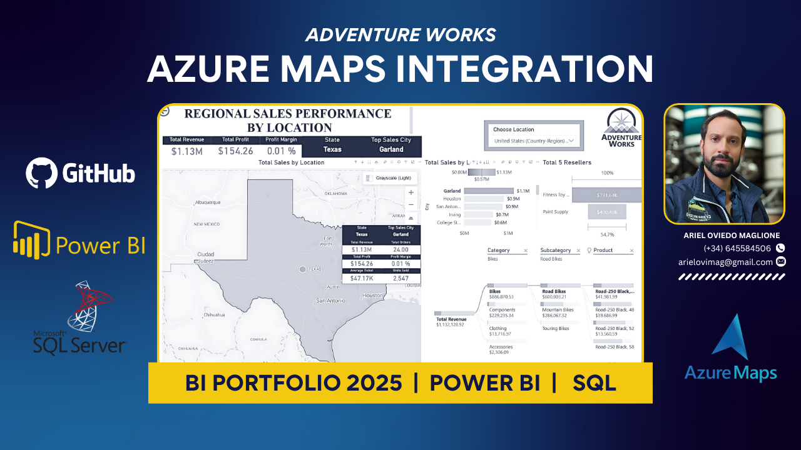

---

 

# adventureworks-bi-portfolio
Full Business Intelligence Portfolio | Adventure Works Sales Data Analysis | Power BI Projects
# 🚀 Business Intelligence Portfolio – Phase 2

## 📊 Regional Sales Performance with Azure Maps – Adventure Works Dataset

This project represents Phase 2 of my BI Portfolio development, focusing on advanced geospatial analysis, data storytelling, and enriched dynamic narratives using:

✅ Power BI  
✅ Azure Maps  
✅ DAX Measures  
✅ Smart Narrative AI  
✅ Interactive Drillthrough  
✅ Decomposition Tree  
✅ Hierarchies: Country ➔ State ➔ City  
✅ Dynamic Top Reseller & Revenue measures  
✅ Advanced Crossfilter Management

---

## 🔗 Live Power BI Report

👉 [Click here to view the full interactive report]([PUBLIC-POWER-BI-SERVICE-LINK](https://app.powerbi.com/view?r=eyJrIjoiMDEzYTZmNjMtYjNjMS00YzUyLTlhOWEtODY4ZmY4ZmZjZmRiIiwidCI6IjQwOWY3ZjkzLTQ0N2EtNDBiYi05YzVjLWQ1MjI1M2E1ZjM5YiIsImMiOjZ9))

---

## 🔎 Dataset

- **Source**: Simulated AdventureWorks Reseller Sales Dataset
- **Model type**: Star Schema with fact and dimension tables:
  - Fact Table: `Sales_data`
  - Dimensions: `Reseller_data`, `Customer_data`, `Product_data`, `Sales_Territory_data`, `Date_Query`, `Sales_Order_data`

---

## 🗺️ Data Modeling

- Cleaned surrogate keys with `-1` unknown keys using Power Query M transformations
- Applied data enrichment for state/province hierarchies
- Managed cross-filtering for slicers and visual interactions
- Dynamic DAX ranking for Top State, Top City and Top Reseller

---

## 📈 Key Visualizations

- Azure Maps with dynamic geographic selection  
- Sales by Location (Country > State > City)  
- Decomposition Tree for Product Category/Subcategory/Product  
- KPI Cards with:
  - Total Revenue
  - Total Profit
  - Profit Margin
  - Average Ticket
  - Units Sold
  - Top Performing State & Reseller
- Fully automated Smart Narrative for dynamic data storytelling

---

## 🎯 Learning Objectives

- Complex filter context evaluation in DAX
- Storytelling through dynamic narratives
- Business scenario simulation for recruiters:
  - CPG / Retail / Supply Chain Performance
  - Sales Regional Optimization

---

## 📄 Data Dictionary

| Table | Key Fields | Description |
| --- | --- | --- |
| Sales_data | Total Revenue, Profit, Orders | Main fact table |
| Reseller_data | Reseller, City, State | Reseller hierarchy |
| Customer_data | Customer, City | Customer hierarchy |
| Product_data | Category, Subcategory, Product | Product master |
| Sales_Territory_data | Region, Country | Regional mapping |
| Date_Query | Calendar hierarchy | Time intelligence |

---

## 💡 Next Steps

In Phase 3 I will integrate:

- 🔮 Predictive forecasting models (Python/R)
- 🧠 AI-powered anomaly detection
- 🎯 Supply Chain scenario simulations

---

## 🔗 Project Links

- 🎯 [GitHub Master Portfolio](https://github.com/arielovimag/adventureworks-bi-portfolio)
- 📊 [Power BI Service (Public Link)]((https://app.powerbi.com/view?r=eyJrIjoiMDEzYTZmNjMtYjNjMS00YzUyLTlhOWEtODY4ZmY4ZmZjZmRiIiwidCI6IjQwOWY3ZjkzLTQ0N2EtNDBiYi05YzVjLWQ1MjI1M2E1ZjM5YiIsImMiOjZ9))

---

## 📩 Contact

> **Ariel Oviedo Maglione**  
> 📞 (+34) 645584506  
> 📧 arielovimag@gmail.com  
> 💼 [LinkedIn Profile](https://www.linkedin.com/in/arielovimag/)

---

